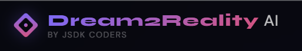
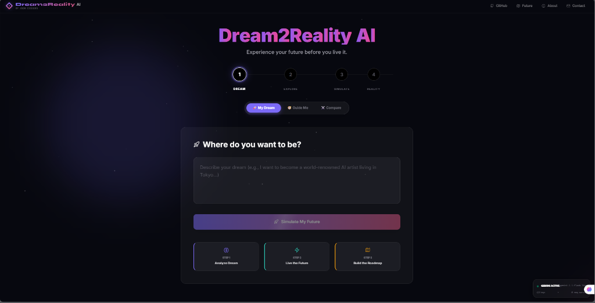
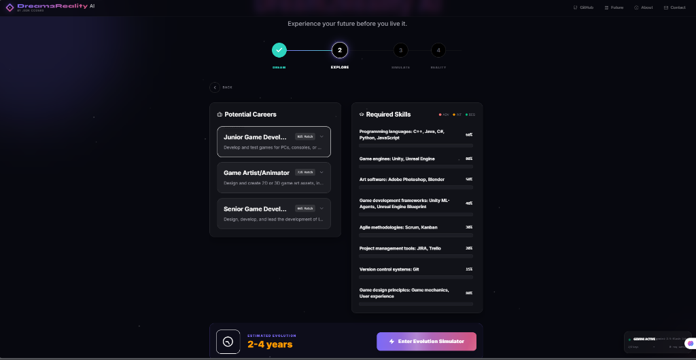
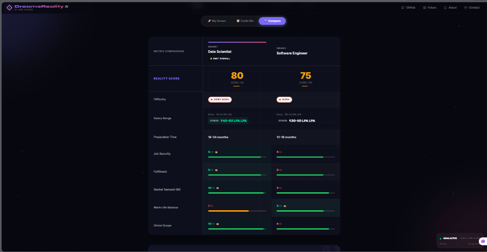
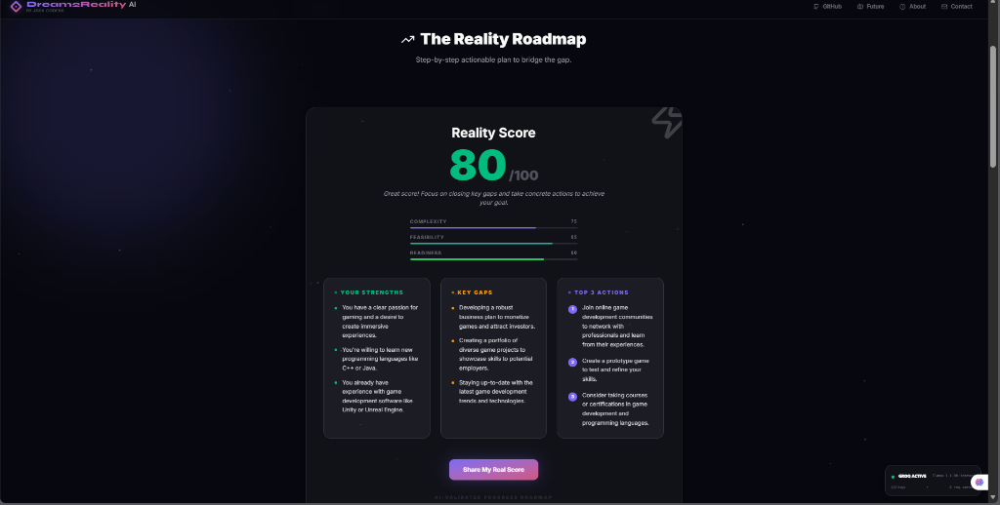

<div align="center">

# 🚀 Dream2Reality AI

### *Experience your future before you live it.*

[](https://nextjs.org/)
[](https://typescriptlang.org/)
[](https://tailwindcss.com/)
[](https://framer.com/motion/)
[](https://groq.com/)

<br/>

> **Built in 24 hours at AI Hackathon — March 2026**
> 
> By **JSDK Coders** 🏆

<br/>



<br/>

[🌐 Live Demo](https://dream2reality-opal.vercel.app/) · [📹 Demo Video](#) · [🐛 Report Bug](../../issues) · [💡 Request Feature](../../issues)

</div>

---

## 📖 The Problem We Solve

**800 million Indians under 35. 30 million students choosing careers every year. Zero personalized guidance.**

Most students either follow what their parents suggest, copy what their friends are doing, or pick whatever seems most popular — without ever truly understanding what that career looks like, what it requires, or how long it'll take to get there.

**Dream2Reality AI changes that.**

Type one sentence describing your dream career. Get a complete, personalized roadmap — instantly.

---

## ✨ What It Does

<table>
<tr>
<td width="50%">

### 🎯 Step 1 — Dream Input
Type your dream career in one sentence. Speak it using voice input. Or let the AI guide you with a 5-question career quiz if you're not sure what you want.

</td>
<td width="50%">

### 🔍 Step 2 — Explore
Get a full skill gap analysis, potential career matches with % scores, required skills with progress bars, and expandable career cards with salary data and top companies.

</td>
</tr>
<tr>
<td width="50%">

### 🎮 Step 3 — Simulate
Live AI career simulation with real workplace scenarios. Make decisions as if you're already in the job. Get instant feedback. Build your career readiness score.

</td>
<td width="50%">

### 🏆 Step 4 — Reality
Your Reality Score (0-100), salary trajectory chart, mentor profiles of real people who made the same journey, learning resources, and a week-by-week roadmap.

</td>
</tr>
</table>

---

## 🖥️ Screenshots

<div align="center">

| Dream Input | Skill Analysis |
|:-----------:|:--------------:|
|  |  |

| Dream Comparison | Reality Score |
|:----------------:|:-------------:|
|  |  |

</div>

---

## 🛠️ Tech Stack

### Frontend
| Technology | Purpose |
|---|---|
| **Next.js 15** | React framework with App Router |
| **TypeScript** | Type safety throughout |
| **Tailwind CSS v4** | Utility-first styling |
| **Framer Motion** | Animations and transitions |
| **Lucide React** | Icon library |
| **React Toastify** | Notifications |

### AI & Backend
| Technology | Purpose |
|---|---|
| **Groq API** | Primary LLM — 14,400 free req/day |
| **Google Gemini** | Secondary LLM — 1,500 free req/day |
| **OpenRouter** | Tertiary — free model fallback |
| **Multi-provider Rotation** | Zero downtime AI switching |

### Architecture
| Feature | Implementation |
|---|---|
| **3-layer caching** | localStorage + server Map + React state |
| **API key rotation** | Round-robin with rate limit detection |
| **Streaming responses** | SSE for real-time text generation |
| **Parallel API calls** | Promise.all for dream comparison |

---

## 🚀 Key Features

- **🧠 AI Career Simulation** — Real workplace scenarios with branching choices and immediate feedback
- **📊 Skill Gap Analysis** — Visual skill trees showing exactly what you need to learn
- **💰 Salary Trajectory** — Year 1 → Year 10 earnings chart with India + global comparison
- **👥 Mentor Profiles** — Real professionals who made the same career journey
- **⚔️ Dream Comparison** — Compare 2-3 careers side by side with 8 metrics
- **🧭 Career Guidance Quiz** — 5 questions → 3 personalized career recommendations
- **🔄 API Key Rotation** — Automatic switching across 3 AI providers, zero downtime
- **⚡ Smart Caching** — Same dream never calls the API twice (24hr cache)
- **📱 Live API Status** — Real-time widget showing active provider and request count
- **🗺️ Product Roadmap** — Transparent view of upcoming features

---

## ⚡ Getting Started

### Prerequisites
- Node.js 18+
- npm or yarn
- API keys (see below)

### Installation

```bash
# Clone the repository
git clone https://github.com/YOUR_USERNAME/dream2reality-ai.git
cd dream2reality-ai

# Install dependencies
npm install

# Set up environment variables
cp .env.example .env.local
```

### Environment Variables

```env
# Get free keys from these sources:

# Groq — FREE 14,400 req/day — console.groq.com
GROQ_API_KEYS=gsk_key1,gsk_key2,gsk_key3

# Google Gemini — FREE 1,500 req/day — aistudio.google.com
GEMINI_API_KEYS=AIza_key1,AIza_key2

# OpenRouter — FREE models — openrouter.ai
OPENROUTER_API_KEYS=sk-or-key1,sk-or-key2
```

> 💡 **Pro tip:** Create multiple accounts on each platform to multiply your free quota. 3 Groq accounts = 43,200 free requests/day.

### Run Development Server

```bash
npm run dev
# Open http://localhost:3000
```

### Build for Production

```bash
npm run build
npm start
```

---

## 🔄 API Rotation Architecture

One of our key technical innovations — a multi-provider AI client that automatically rotates across providers and API keys:

```
Request comes in
      ↓
Check server cache (Map) → HIT? Return instantly
      ↓ MISS
Try Groq (14,400 req/day, fastest)
      ↓ Rate limited?
Try Gemini (1,500 req/day)
      ↓ Rate limited?
Try OpenRouter (free models)
      ↓ All exhausted?
Return graceful error
      ↓ Success
Store in server cache + localStorage
Return to frontend
```

Keys rotate round-robin. Rate-limited keys cool down for 60 seconds then re-enter the pool automatically.

---

## 🚀 Deploy to Vercel

[](https://vercel.com/new/clone?repository-url=https://github.com/YOUR_USERNAME/dream2reality-ai)

1. Click the button above
2. Add your environment variables in Vercel dashboard
3. Deploy — live in 2 minutes ✅

---

## 📁 Project Structure

```
dream2reality-ai/
├── app/
│   ├── api/
│   │   ├── dream/          # Main dream analysis endpoint
│   │   ├── simulate/       # Career simulation scenarios
│   │   ├── compare-dreams/ # Multi-dream comparison
│   │   ├── career-guidance/# Quiz-based recommendations
│   │   └── ai-status/      # Live API status endpoint
│   ├── page.tsx            # Main 4-step app
│   └── layout.tsx
├── components/
│   ├── DreamInput.tsx      # Step 1 — voice + text input
│   ├── ExploreScreen.tsx   # Step 2 — careers + skills
│   ├── Simulator.tsx       # Step 3 — career simulation
│   ├── RealityScreen.tsx   # Step 4 — score + roadmap
│   ├── DreamCompare.tsx    # Dream comparison table
│   ├── CareerQuiz.tsx      # 5-question guidance quiz
│   ├── Navbar.tsx          # Logo + modals
│   └── ApiStatusWidget.tsx # Live provider status
├── lib/
│   ├── aiRotator.ts        # Multi-provider key rotation
│   ├── dreamCache.ts       # localStorage caching
│   ├── serverCache.ts      # Server-side Map cache
│   └── ai.ts              # Prompt templates
└── .env.example
```

---

## 🎯 How We Beat the Rate Limit Problem

Most AI hackathon projects crash when the API rate limit hits. We solved this with three layers:

| Layer | Storage | TTL | Purpose |
|---|---|---|---|
| React State | Memory | Session | Instant re-renders |
| localStorage | Browser | 24 hours | Survives page refresh |
| Server Map | Node.js | 1 hour | Shared across requests |

**Result:** The same dream analyzed 100 times = **1 API call.**

---

## 👥 The Team — JSDK Coders

| | Name | Role |
|---|---|---|
| **D** | **Devansh Katkar** | Full Stack Developer & AI Architect - Lead Engineer |
| **J** | **Jeet Dubey** | Product Strategist & Ideation Lead |
| **S** | **Saanvi Gupta** | Presenter & Communications Lead |
| **K** | **Kajal Kumawat** | Quality Assurance & Testing Lead |

---

## 🗺️ Roadmap

### Coming Soon 🟢
- [ ] AI Mock Interview Simulator
- [ ] Peer Learning Network
- [ ] Mobile App (iOS & Android)

### In Development 🟡
- [ ] College & Entrance Exam Roadmap (GATE, NEET, CLAT)
- [ ] Global University Matcher
- [ ] Real Job Listings Integration

### Future Vision 🟣
- [ ] 1-on-1 Mentor Booking
- [ ] Progress Tracking Dashboard
- [ ] Career Achievement System

---

## 🤝 Contributing

We'd love contributions! Here's how:

```bash
# Fork the repo
# Create your feature branch
git checkout -b feature/AmazingFeature

# Commit your changes
git commit -m 'Add AmazingFeature'

# Push to the branch
git push origin feature/AmazingFeature

# Open a Pull Request
```

---

## 📄 License

Distributed under the MIT License. See `LICENSE` for more information.

---

## 🙏 Acknowledgements

- [Groq](https://groq.com/) — For insanely fast free LLM inference
- [Google AI Studio](https://aistudio.google.com/) — For Gemini API access
- [OpenRouter](https://openrouter.ai/) — For free model access
- [Vercel](https://vercel.com/) — For seamless deployment
- [Framer Motion](https://framer.com/motion/) — For beautiful animations

---

<div align="center">

**Built with ❤️ by JSDK Coders at AI Hackathon 2026**

*"Every student has a dream. We built the map to get there."*

⭐ **Star this repo if you found it useful!** ⭐

</div>
